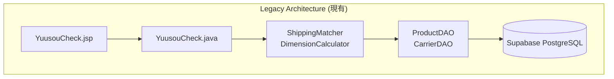
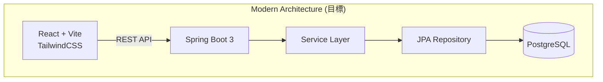

# SmartShip 現代化實作計畫
## Legacy Servlet → Spring Boot 3 + React (Vite) + Tailwind CSS

---

## 📋 專案概述

### 目標
將現有的 Java Servlet + JSP 應用程式現代化為 **Spring Boot 3 + React + Tailwind CSS** 架構，同時增加 **3D 包裹視覺化** 功能。

### 現有架構分析



### 目標架構



---

## 🗂️ 現有程式碼結構

| Layer | 檔案 | 說明 |
|-------|-----|------|
| **Servlet** | `YuusouCheck.java` | 主要控制器，處理購物車與運費計算 |
| **Model** | `ProductReference.java`, `ShippingCarrier.java`, `Dimensions.java`, `CartItem.java` | 資料模型 |
| **Service** | `ShippingMatcher.java`, `DimensionCalculator.java` | 核心商業邏輯 |
| **DAO** | `ProductDAO.java`, `CarrierDAO.java` | 資料存取層 |
| **View** | `YuusouCheck.jsp`, `YuusouCheckResult.jsp` | JSP 模板 |
| **Database** | `schema.sql`, `data.sql` | PostgreSQL DDL/DML |

---

## 🎯 實作範圍

### Phase 1: Backend 現代化 (Spring Boot 3)

#### 1.1 專案結構

```
src/main/java/com/smartship/
├── SmartShipApplication.java          [NEW]
├── config/
│   └── CorsConfig.java                [NEW]
├── controller/
│   ├── ProductController.java         [NEW]
│   └── ShippingController.java        [NEW]
├── dto/
│   ├── request/
│   │   ├── ManualDimensionRequest.java    [NEW]
│   │   └── CartCalculationRequest.java   [NEW]
│   └── response/
│       ├── ProductResponse.java       [NEW]
│       ├── ShippingResultResponse.java    [NEW]
│       └── CalculationResponse.java   [NEW]
├── entity/
│   ├── ProductReference.java          [MIGRATE]
│   └── ShippingCarrier.java           [MIGRATE]
├── repository/
│   ├── ProductRepository.java         [NEW]
│   └── ShippingCarrierRepository.java [NEW]
└── service/
    ├── DimensionCalculator.java       [MIGRATE]
    └── ShippingMatcher.java           [MIGRATE]
```

---

### Phase 2: Frontend 現代化 (React + Vite + Tailwind)

#### 2.1 專案結構

```
frontend/
├── index.html
├── vite.config.js
├── tailwind.config.js
├── package.json
└── src/
    ├── main.jsx
    ├── App.jsx
    ├── index.css                      (Tailwind imports)
    ├── api/
    │   └── shippingApi.js             (fetch 封裝)
    ├── components/
    │   ├── ProductCard.jsx
    │   ├── CartPanel.jsx
    │   ├── ShippingResult.jsx
    │   ├── ManualInputForm.jsx
    │   └── ParcelVisualizer3D.jsx     (3D CSS Box)
    └── pages/
        └── ShippingCalculator.jsx     (主頁面)
```

---

## 🔧 詳細實作計畫

### Backend 實作細節

---

#### [NEW] `src/main/java/com/smartship/SmartShipApplication.java`

Spring Boot 3 應用程式進入點。

---

#### [NEW] `src/main/java/com/smartship/config/CorsConfig.java`

全域 CORS 設定，允許以下來源：
- `http://localhost:5173` (Vite 開發伺服器)
- `*.vercel.app` (生產部署)

> [!IMPORTANT]
> 不使用 `@CrossOrigin` 註解，統一透過 `WebMvcConfigurer` 處理。

---

#### [NEW] `src/main/java/com/smartship/dto/request/CartCalculationRequest.java`

```java
// Request DTO for cart-based calculation
public record CartCalculationRequest(
    List<CartItemDto> items
) {}

public record CartItemDto(
    int productId,
    int quantity
) {}
```

---

#### [NEW] `src/main/java/com/smartship/dto/request/ManualDimensionRequest.java`

```java
// Request DTO for manual dimension input
public record ManualDimensionRequest(
    double lengthCm,
    double widthCm,
    double heightCm,
    int weightG
) {}
```

---

#### [NEW] `src/main/java/com/smartship/controller/ShippingController.java`

| Endpoint | Method | 說明 |
|----------|--------|------|
| `/api/shipping/calculate/manual` | POST | 手動輸入計算 |
| `/api/shipping/calculate/cart` | POST | 購物車計算 |

---

#### [NEW] `src/main/java/com/smartship/controller/ProductController.java`

| Endpoint | Method | 說明 |
|----------|--------|------|
| `/api/products` | GET | 取得所有產品 (可選 category filter) |
| `/api/products/categories` | GET | 取得所有分類 |

---

#### [MIGRATE] `src/main/java/com/smartship/entity/ProductReference.java`

從現有 Model 遷移，增加 JPA 註解：
- `@Entity`, `@Table`, `@Id`, `@GeneratedValue`

---

#### [MIGRATE] `src/main/java/com/smartship/entity/ShippingCarrier.java`

從現有 Model 遷移，增加 JPA 註解。

---

#### [MIGRATE] `src/main/java/com/smartship/service/ShippingMatcher.java`

從現有 Service 遷移：
- 移除 DAO 直接呼叫，改用注入的 Repository
- 加入 `@Service` 註解

---

#### [MIGRATE] `src/main/java/com/smartship/service/DimensionCalculator.java`

從現有 Service 遷移：
- 加入 `@Service` 註解
- 保留現有計算邏輯 (smart stacking、soft item compression)

---

### Frontend 實作細節

---

#### [NEW] `frontend/src/components/ParcelVisualizer3D.jsx`

使用純 CSS 3D 效果實現包裹視覺化：

**技術要點：**
- 外層容器: `perspective: 800px`
- 內層盒子: `transform-style: preserve-3d`
- 動態調整: `width`, `height`, `transform: rotateX() rotateY() translateZ()`
- 依據尺寸動態縮放比例 (e.g., 1cm = 2px)

---

#### [NEW] `frontend/src/api/shippingApi.js`

使用標準 `fetch` API，不使用 axios：

```javascript
const API_BASE = import.meta.env.VITE_API_URL || 'http://localhost:8080';

export const calculateFromCart = async (items) => {
  const res = await fetch(`${API_BASE}/api/shipping/calculate/cart`, {
    method: 'POST',
    headers: { 'Content-Type': 'application/json' },
    body: JSON.stringify({ items })
  });
  return res.json();
};
```

---

#### [NEW] `frontend/src/pages/ShippingCalculator.jsx`

主頁面組件，包含：

1. **產品選擇區** - Grid 顯示產品卡片
2. **購物車區** - 顯示已選商品與數量控制
3. **3D 視覺化區** - 即時顯示包裹尺寸
4. **結果區** - 顯示推薦運送方式

---

### Tailwind CSS 設計規範 (Shadcn 風格)

| 元素 | 類別 |
|-----|------|
| 主色 | `blue-600`, `blue-700` |
| 背景 | `zinc-50`, `zinc-100` |
| 文字 | `zinc-900`, `zinc-600` |
| 邊框 | `border-zinc-200`, `rounded-md` |
| 卡片 | `bg-white shadow-sm border rounded-lg` |
| 按鈕 | `bg-blue-600 hover:bg-blue-700 text-white rounded-md px-4 py-2` |
| Focus | `focus-visible:ring-2 focus-visible:ring-blue-500 focus-visible:ring-offset-2` |

---

## ✅ 驗證計畫

### 後端測試

> [!NOTE]
> 目前專案無現有測試檔案。需建立新的測試套件。

#### 單元測試 (JUnit 5)

| 測試檔案 | 測試範圍 |
|---------|---------|
| `DimensionCalculatorTest.java` | 尺寸計算邏輯、壓縮係數 |
| `ShippingMatcherTest.java` | 運送匹配邏輯、價格排序 |

**執行指令：**
```bash
cd backend
./mvnw test
```

#### 整合測試

| 測試檔案 | 測試範圍 |
|---------|---------|
| `ShippingControllerIT.java` | REST API 端點測試 |

**執行指令：**
```bash
cd backend
./mvnw verify
```

---

### 前端測試

#### 手動驗證步驟

1. **啟動後端**
   ```bash
   cd backend
   ./mvnw spring-boot:run
   ```

2. **啟動前端**
   ```bash
   cd frontend
   npm install
   npm run dev
   ```

3. **驗證項目**

   | 項目 | 預期結果 |
   |-----|---------|
   | 產品載入 | 頁面顯示所有產品卡片，可按分類過濾 |
   | 加入購物車 | 點擊產品後購物車更新，3D 盒子大小變化 |
   | 計算運費 | 送出後顯示推薦運送方式與價格 |
   | 3D 視覺化 | 盒子尺寸隨商品增減即時更新 |
   | 手動輸入 | 可切換至手動輸入模式計算 |

---

### 瀏覽器自動化測試

使用 browser_subagent 進行 E2E 測試：

1. 開啟 `http://localhost:5173`
2. 點擊「少年コミック」產品卡片
3. 驗證購物車顯示 1 件商品
4. 點擊「配送料をチェック」按鈕
5. 驗證結果頁面顯示推薦運送方式

---

## 🗓️ 實作路線圖 (Step-by-Step)

### ✅ Milestone 1: 專案初始化 (Setup) — DONE

| Step | 任務 | 狀態 |
|------|------|------|
| 1.1 | 建立 `/backend` 資料夾 | ✅ |
| 1.2 | 初始化 Spring Boot 3.5.0 專案 (Maven) | ✅ |
| 1.3 | 設定 `application.properties` (Supabase 連線) | ✅ |
| 1.4 | 建立 `/frontend` 資料夾 | ✅ |
| 1.5 | 初始化 Vite + React 19 專案 | ✅ |
| 1.6 | 設定 Tailwind CSS 3.4 | ✅ |

**驗收點**: 兩個專案都能成功啟動 (無錯誤) ✅

---

### ✅ Milestone 2: Backend - Entity & Repository — DONE

| Step | 任務 | 狀態 |
|------|------|------|
| 2.1 | 建立 `ProductReference.java` Entity (JPA) | ✅ |
| 2.2 | 建立 `ShippingCarrier.java` Entity (JPA) | ✅ |
| 2.3 | 建立 `ProductRepository.java` | ✅ |
| 2.4 | 建立 `ShippingCarrierRepository.java` | ✅ |
| 2.5 | 啟動測試：確認能讀取 Supabase 資料 | ✅ |

**驗收點**: `./mvnw spring-boot:run` 成功，console 無連線錯誤 ✅

---

### ✅ Milestone 3: Backend - Service & Controller — DONE

| Step | 任務 | 狀態 |
|------|------|------|
| 3.1 | 建立 `Dimensions.java` DTO | ✅ |
| 3.2 | 遷移 `DimensionCalculator.java` Service | ✅ |
| 3.3 | 遷移 `ShippingMatcher.java` Service | ✅ |
| 3.4 | 建立 Request/Response DTO 類別 | ✅ |
| 3.5 | 建立 `CorsConfig.java` | ✅ |
| 3.6 | 建立 `ProductController.java` | ✅ |
| 3.7 | 建立 `ShippingController.java` | ✅ |
| 3.8 | 使用 curl 測試 API 端點 | ✅ |

**驗收點**: `curl http://localhost:8080/api/products` 返回 JSON 資料 ✅

---

### ✅ Milestone 4: Frontend - 基礎 UI — DONE

| Step | 任務 | 狀態 |
|------|------|------|
| 4.1 | 建立 `shippingApi.js` (fetch 封裝) | ✅ |
| 4.2 | 建立 `ProductCard.jsx` 組件 | ✅ |
| 4.3 | 建立 `CategoryTabs.jsx` 組件 | ✅ |
| 4.4 | 建立產品列表頁面 (載入 API 資料) | ✅ |
| 4.5 | 瀏覽器測試：確認產品卡片顯示 | ✅ |

**驗收點**: 頁面顯示所有產品卡片，可按分類過濾 ✅

---

### ✅ Milestone 5: Frontend - 購物車 & 計算 — DONE

| Step | 任務 | 狀態 |
|------|------|------|
| 5.1 | 建立 `CartPanel.jsx` 組件 | ✅ |
| 5.2 | 實作購物車狀態管理 (useState) | ✅ |
| 5.3 | 建立 `ManualInputForm.jsx` 組件 | ✅ |
| 5.4 | 建立 `ShippingResult.jsx` 組件 | ✅ |
| 5.5 | 整合計算功能 (呼叫後端 API) | ✅ |
| 5.6 | 測試完整流程 | ✅ |

**驗收點**: 選擇商品 → 計算 → 顯示推薦運送方式 ✅

---

### Milestone 6: 3D 視覺化 & 完成

| Step | 任務 | 預估時間 |
|------|------|----------|
| 6.1 | 建立 `ParcelVisualizer3D.jsx` 基礎結構 | 15 min |
| 6.2 | 實作 CSS 3D 旋轉效果 | 20 min |
| 6.3 | 連接購物車狀態，動態更新尺寸 | 10 min |
| 6.4 | 整合到主頁面 | 5 min |
| 6.5 | 最終 UI 調整與美化 | 15 min |
| 6.6 | E2E 測試驗證 | 10 min |

**驗收點**: 3D 盒子隨商品增減即時變化

---

## ✅ 已確認決策

| 項目 | 決策 |
|-----|------|
| **資料庫** | 繼續使用 **Supabase PostgreSQL** |
| **專案結構** | **Monorepo** (`/backend`, `/frontend`) |
| **Frontend 部署** | **Vercel** |
| **Backend 部署** | **Render** (暫定) |
| **PDF 生成** | ❌ 不包含 |
| **統計圖表** | ❌ 不包含 |

---

## 🚀 下一步

確認後，從 **Milestone 1: Step 1.1** 開始實作！
